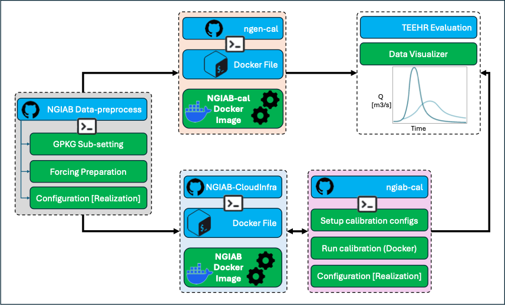
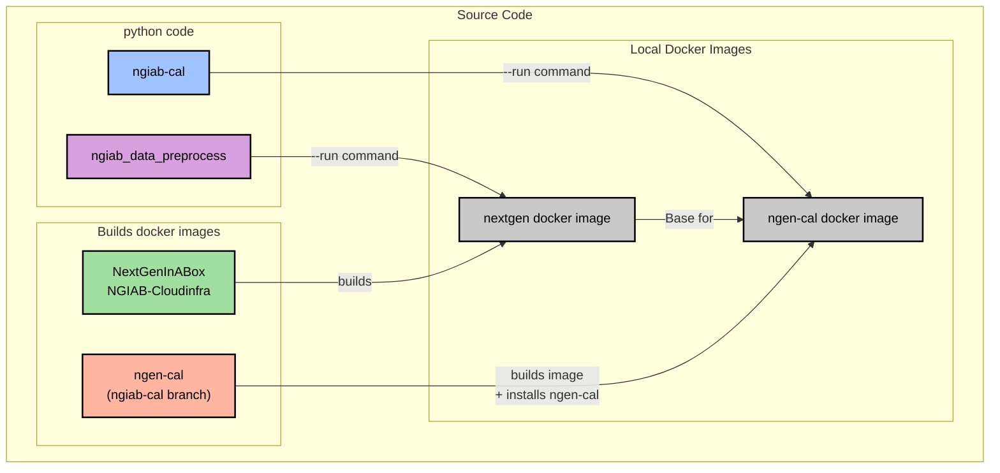

# CIROH DevCon 2025 Workshop: Hydrological Model Calibration in the NGIAB Ecosystem

Welcome to the GitHub repository for the CIROH DevCon 2025 workshop: **"How do I calibrate, regionalize and share the calibrated parameters in a NextGen Framework ecosystems"**.

* **Date**: Thursday, May 29, 2025
* **Time**: 1:30 PM – 3:00 PM (US Eastern Time)
* **Address**: UVM Dudley H. Davis Center – Level 4, 590 Main Street, Burlington, VT 05405
* **Organized by the [Cooperative Institute for Research to Operations in Hydrology - CIROH](https://ciroh.ua.edu/devconference/)**

---

## Table of Contents

* [Workshop Purpose](#workshop-purpose)
* [What is NextGen?](#what-is-nextgen)
* [Part 1: Step-by-Step Instruction (Using Ready-made Data and Docker Images)](#part-1-step-by-step-instruction-using-ready-made-data-and-docker-images)
    * [1.1. Tools/Modules Used for End-to-End Workflow](#11-toolsmodules-used-for-end-to-end-workflow)
    * [1.2. Introduction to the End-to-End Workflow Process](#12-introduction-to-the-end-to-end-workflow-process)
    * [1.3. Workshop Slides](#13-workshop-slides)
    * [1.4. Pre-Workshop Checklist](#14-pre-workshop-checklist)
        * [Knowledge and Experience](#knowledge-and-experience)
        * [Hardware and Software](#hardware-and-software)
        * [Accounts](#accounts)
* [Part 2: Step-by-Step Instruction for Calibration Workshop (Development Setup)](#part-2-step-by-step-instruction-for-calibration-workshop-development-setup)
* [Contact](#contact)
* [Acknowledgment](#acknowledgment)

---

## Workshop Purpose

This workshop offers a comprehensive guide to hydrological model calibration, regionalization, and parameter sharing within the NextGen In A Box (NGIAB) ecosystem. Participants will gain hands-on experience calibrating models using open-source tools and pre-made data with NGIAB and NGEN-Cal Docker images. The session includes step-by-step instructions for these practical exercises, alongside guidance for a development setup to modify underlying codes. Attendees will also learn best practices for regionalizing calibrated parameters for ungauged basins, explore effective methods for collaborative parameter management, and engage with a theoretical discussion on regionalization techniques. By the end, participants will possess practical skills and resources to enhance the reproducibility and scalability of their modeling workflows.

Specifically, participants will:
- Understand the fundamentals and theoretical underpinnings of model calibration, including its role in improving hydrological model accuracy.
- Learn the theoretical basis of regionalization techniques for applying calibrated parameters to improve predictions in ungauged basins.
- Gain hands-on experience with the step-by-step process of setting up and executing a full model calibration workflow within the NextGen/NGIAB ecosystem, utilizing open-source tools and pre-configured datasets.
- Explore tools and methods for effectively sharing and managing calibrated parameters within a collaborative environment.
- Engage with peers and instructors to discuss challenges and best practices in hydrological model calibration and parameter estimation.



_Figure 1: End-to-end visual representation of the NextGen In A Box (NGIAB) ecosystem's hydrological simulation workflow, detailing phases for data preparation, model simulation, parameter calibration, and output analysis steps._

---

## What is NextGen?

The Next Generation Water Resources Modeling Framework (NextGen) is a model-agnostic, standards-based, model interoperability software tool. It allows for the explicit coupling of models by enabling the sequential sharing of computed states and/or fluxes between different domain science models or modules.

Key characteristics and components include:
* **Model Interoperability**: Designed to facilitate seamless interaction between various hydrological models and modules.
* **Standards-Based**: Adheres to defined standards to ensure consistency and compatibility.
* **Model-Agnostic**: Supports integration of different models regardless of their origin or specific structure.
* **Multi-language Support**: The framework currently supports models written in C++, C, Fortran, and Python, and encourages the use of mature open-source libraries where appropriate.

Platforms:
NextGen is designed to be flexible and can be built and run on various platforms, including:
* Virtual Machines (VMs) in cloud environments.
* High-Performance Computing (HPC) clusters.
* Personal computers (macOS, Windows via WSL2, Linux) using containerization tools like Docker [Singularity on HPC].

---

## Part 1: Step-by-Step Instruction (Using Ready-made Data and Docker Images)

This section guides you through the calibration workshop using the provided datasets and Docker images.

### 1.1. Tools/Modules Used for End-to-End Workflow

This workshop leverages containerized environments to ensure consistency and ease of use. There are four tools [two contenarized based and two python CLI based] used in combination to carry out the calibration workflow in the NGIAB ecosystem.    
The use of docker containers and pipx packages mean you *do not need to install these tools to use them*. The only required software are [docker](https://docs.docker.com/engine/install/) and [astral-uv (uv)](https://docs.astral.sh/uv/getting-started/installation/). The modules in the `tools` folder are reference and development.
    
* **NGIAB (NextGen In A Box) Docker Image**: The NGIAB Docker image provides a containerized and user-friendly solution for running the NextGen framework. It bundles the NextGen software, its dependencies, and necessary tools, allowing you to control inputs, configurations, and model execution on your local machine or other Docker-compatible environments.
    * **Build/Source**: The image is constructed using a Dockerfile which defines the operating system, installs required libraries, and packages the NextGen executables and associated scripts. *(The specific submodule for building this image is `tools/NGIAB-CloudInfra`, contains the Dockerfile and build scripts. For detailed instructions on building the image from the source, please refer to Part 2: Development Setup of this README). The latest NGIAB Docker image version used in this workshop is available on Docker-Hub [`awiciroh/ngiab:devcon25`]. See Development Setup of this README for details.*
    
* **NGEN-Cal Docker Image**: NGEN-Cal refers to the supporting code and workflows designed for the automated calibration of NextGen model formulations. This workshop specifically utilizes its capabilities for calibration, employing parameter optimization algorithms - Dynamic Dimensioned Search (DDS).
    * **Build/Source**: While the core NGEN-Cal calibration logic is Python-based (source code found in the `tools/ngen-cal` submodule), for ease of use in this workshop, it's often packaged within a Docker environment. A Docker image configured with NGEN-Cal and its dependencies for this workshop can be accessed from Docker Hub [`awiciroh/ngiab-cal:devcon25`]. For detailed instructions on modifying the NGEN-Cal code and potentially rebuilding its environment or image, please refer to Part 2: Development Setup of this README (also see Figure 1 for workflow context).*
    
* **NGIAB-Data-Preprocess**: This tool prepares data to run a next gen simulation by creating a run package that can be used with NGIAB. It uses geometry and model attributes from the [v2.2 hydrofabric](https://lynker-spatial.s3-us-west-2.amazonaws.com/hydrofabric/v2.2/conus/conus_nextgen.gpkg) more information on [all data sources here](https://lynker-spatial.s3-us-west-2.amazonaws.com/hydrofabric/v2.2/hfv2.2-data_model.html). The raw forcing data is [nwm retrospective v3 forcing](https://noaa-nwm-retrospective-3-0-pds.s3.amazonaws.com/index.html#CONUS/zarr/forcing/) data or the [AORC 1km gridded data](https://noaa-nws-aorc-v1-1-1km.s3.amazonaws.com/index.html) depending on user input.
    
* **NGIAB-Cal**: This is a utility that works with the [NGIAB folder structure](https://docs.ciroh.org/training-NGIAB-101/data-preparation.html#nextgen-run-directory-structure-ngen-run). It automates the creation of a calibration directory with all necessary configuration files to run a modified version of [ngen-cal](https://github.com/CIROH-UA/ngen-cal/tree/ngiab_cal). The tool simplifies these key tasks like - Creating calibration configurations, running the calibration process using Docker, and copying calibrated parameters back to your model configuration. The tool applies a standard hydrological modeling workflow, which involves warmup, calibration, and validation periods. The --warmup period is crucial for allowing the model to reach a stable state before its performance is evaluated against observed data. Following the warmup, the remaining period is typically divided into calibration (where model parameters are adjusted to match observations) and validation (where the model's performance with the calibrated parameters is tested on an independent dataset). The tool facilitates this split, as detailed in the diagram and options below.

---

### 1.2. Introduction to the End-to-End Workflow Process

To execute NextGen-based hydrological model simulations and proceed to calibration, a general workflow involves several key stages: preprocessing of forcing and hydrofabric data, creation of model configurations (realizations), setup of calibration parameters, and finally, the execution of simulation runs (as illustrated in Figure 1). These stages are typically handled by specialized tools within the NGIAB ecosystem:

* **1. Prepare Data and Create Initial Configurations with `NGIAB_data_preprocess`**:

    * **A. Prepare Hydrofabric Data [GPKG]**: This involves preparing the network and catchment information that defines the spatial domain of the model. The hydrofabric data used as a base for this workshop is the [v2.2 CONUS Hydrofabric](https://lynker-spatial.s3-us-west-2.amazonaws.com/hydrofabric/v2.2/conus/conus_nextgen.gpkg). Further details on its data model and sources can be found [here](https://lynker-spatial.s3-us-west-2.amazonaws.com/hydrofabric/v2.2/hfv2.2-data_model.html).
    * The `tools/NGIAB_data_preprocess` tool (`NGIAB_data_preprocess`) also manages the subsetting of this hydrofabric for the specific area of interest and prepares essential model inputs such as soil characteristics, land surface properties, catchment attributes, and flowpath (channel) properties.

    * **B. Prepare Forcing Data [Hydro-Met]**: This step involves preparing the meteorological and other input datasets required to drive the hydrological model.
    * The `tools/NGIAB_data_preprocess` tool (referred to as `NGIAB_data_preprocess`) is utilized for processing various forcing data sources.
    * For this workshop, primary forcing data sources include:
        * [NWM Retrospective v3 forcing data](https://noaa-nwm-retrospective-3-0-pds.s3.amazonaws.com/index.html#CONUS/zarr/forcing/) may be used.
        * Alternatively, [AORC 1km gridded data](https://noaa-nws-aorc-v1-1-1km.s3.amazonaws.com/index.html)

    * **Note on Data for the Workshop**: In the interest of saving time and ensuring consistency for this workshop, a ready-made data package is provided. This package, containing the necessary forcing data (and other required datasets), is located in the [`./Data/`](./Data/) directory of this repository. For more details on the contents and structure of this data, and general information about data sources, please refer to ['./Data/README.md'](Data/Provo_River/README.md). The commands below illustrate how one *would* generate such data using the `NGIAB_data_preprocess` tool.

    * **C. Create Configurations/Realizations**:
        Once the core data is processed, this stage focuses on generating the specific configuration files that NextGen models require to run.
        * This includes preparing initial conditions for the model, defining the NextGen modules configuration (often in a `realization.json` file), setting up the routing configuration (e.g., `troute.yaml`), and establishing per-catchment model component configurations.
        * This part of the workflow is also handled by the `tools/NGIAB_data_preprocess` tool.

    * **D. CLI Command(s) for NGIAB_data_preprocess (covering A, B, C)**:
        The following is an example of how the `NGIAB_data_preprocess` CLI can be used to generate a run package, which includes fetching and processing hydrofabric and forcing data:

        ```bash
        # Example: Prepare data for USGS gage 10154200 for Jan 1, 2022, to Feb 28, 2022, using AORC source,
        # saving to an output folder named 'cal_demo_run_package'.
        uvx run --from ngiab_data_preprocess cli -i gage-10154200 --start 2022-01-01 --end 2022-02-28 -sfr --source aorc -o cal_demo_run_package
        # or
        uvx ngiab-prep -i gage-10154200 --start 2022-01-01 --end 2022-02-28 -sfr --source aorc -o cal_demo_run_package
        ```

        * For deatailed explanation of [`CLI COMMAND`] options refer to the ReadMe file from `tools/NGIAB_data_preprocess`. Here are few of them:

            - `-h`, `--help`: Show the help message and exit.
            - `-i INPUT_FEATURE`, `--input_feature INPUT_FEATURE`: ID of feature to subset. Providing a prefix will automatically convert to catid, e.g., cat-5173 or gage-01646500 or wb-1234.
            - `-s`, `--subset`: Subset the hydrofabric to the given feature.
            - `-f`, `--forcings`: Generate forcings for the given feature.
            - `-r`, `--realization`: Create a realization for the given feature.
            - `--start_date START_DATE`, `--start START_DATE`: Start date for forcings/realization (format YYYY-MM-DD).
            - `--end_date END_DATE`, `--end END_DATE`: End date for forcings/realization (format YYYY-MM-DD).
            - `-o OUTPUT_NAME`, `--output_name OUTPUT_NAME`: Name of the output folder.

* **2. Configure and Execute Calibration with `NGIAB-Cal`**:
    Once the initial model configurations and realizations are prepared (typically by `NGIAB_data_preprocess`), the `NGIAB-Cal` tool (from the `tools/ngiab-cal` submodule) is used to set up the calibration environment and execute the calibration runs. Its functions include creating specific calibration configuration files, managing the execution of the calibration process (often within a Docker environment), and facilitating the transfer of calibrated parameters back into your model configuration files.

    * **A. Calibration Configuration Setup**:
        This initial step involves using the `NGIAB-Cal` command-line interface (CLI) to prepare your project for calibration. Key actions include:

        * **Copying Base Configurations**: `NGIAB-Cal` helps in copying the relevant `realization.json` and `troute.yaml` files from your base model setup into the calibration directory structure.

        * **Preparing Calibration Directories**: The tool automates the creation of the specific directory layout required for the calibration workflow. This process generates the **Expected Directory Structure** detailed in point 3 of this workflow, ensuring all necessary subfolders are in place.

        * **Generating Key Configuration Files**: `NGIAB-Cal` creates or places important configuration files that you will interact with. These files allow you to customize the calibration process by modifying variables such as:
            * Number of calibration iterations.
            * Model simulation start and end date/time for calibration runs.
            * Parameter bounds and initial guesses.
            * Objective function settings.

        * **CLI Commands for Setup**:
            Specific `NGIAB-Cal` commands are used to perform these setup tasks. For detailed command usage, refer to the README file within the `tools/ngiab-cal/` submodule. An example to get help for setup-related commands might be exploring options within the main help or specific subcommands if they exist:
            ```bash
            # Example for general help (as per output provided later)
            uvx ngiab-cal --help
            ```

        * **Editing Options for Calibration Run Setup**:
            Before running the calibration, you will typically need to edit one or more configuration files (e.g., `ngen_cal_conf.yaml` within the `calibration` directory) to define:
            * Paths to observation data (e.g., `obs_hourly_discharge.csv`).
            * Specifics of the calibration algorithm (e.g., DDS parameters).
            * The parameters to be calibrated and their ranges.
            * Time periods for calibration and validation.

    * **B. Running the Calibration Simulation**:
        After the configuration setup is complete and customized, you can initiate the calibration run.
        * **Procedure**: Running the simulation can be done automatically by adding `--run` to the ngiab-cal command as seen below, or manually by running the docker command output by ngiab-cal. If runnning manually, after running the docker command you fill be put into a folder with calibration.sh validation.sh and run.sh (calibration.sh + validation.sh)
        * **Monitoring**: Progress can usually be monitored via log files generated in the output directories (see point **3**) and console output.
        * **CLI Commands for Execution**:
            For detailed command usage, use `--help` or refer to the README file within the `tools/ngiab-cal/` submodule. Examle commands for the different processes of calibration workflow:
            ```bash
            # Create calibration configuration
            uvx ngiab-cal /path/to/ngiab/data/folder -g USGS_GAGE_ID

            # Create and run calibration (200 iterations)
            uvx ngiab-cal /path/to/ngiab/data/folder -g USGS_GAGE_ID --run -i 200

            # Force recreation of calibration configuration
            uvx ngiab-cal /path/to/ngiab/data/folder -g USGS_GAGE_ID -f -i 150
            ```    
    
            * **Help output for `ngiab-cal`**:

            ```
            Create a calibration config for ngen-cal

            usage: ngiab-cal [-h] [-g GAGE] [-f] [--run] [-i ITERATIONS] [--debug] [-w WARMUP] [--calibration_ratio CALIBRATION_RATIO] data_folder

            positional arguments:
              data_folder           Path to the folder you wish to calibrate

            options:
              -h, --help                                    show this help message and exit
              -g GAGE, --gage GAGE                          Gage ID to use for calibration
              -f, --force                                   Overwrite existing configuration
              --run                                         Try to automatically run the calibration, this may be unstable
              -i ITERATIONS, --iterations                   ITERATIONS
                                                            Default:100 number of iterations to calibrate for

              --debug                                       enable debug logging
              -w WARMUP, --warmup                           WARMUP
                                                            Default:365
                                                            Number of days at the beginning of the simulation
                                                            to exclude from calibration objective metric calculation
              --calibration_ratio CALIBRATION_RATIO, --cr   CALIBRATION_RATIO
                                                            Default:0.5
                                                            How to split time after warmup into calibration and validation.
                                                            1 == 100% calibration, 0 == 100% validation, 0.8 == 80% calibration 20% validation
            ```
---

* **3. Expected Directory Structure (Resulting from Data Preprocessing and Calibration)**:
    After running the data preprocessing steps (using `NGIAB_data_preprocess`) and subsequently setting up and executing a calibration run (using `ngiab-cal`), you can expect a directory structure similar to the example below. This structure organizes input configurations, intermediate files, and calibration outputs. The exact contents, especially within the `Output` subdirectories, will depend on the specific configuration and execution of the calibration process.

    The main calibration directory (e.g., `provo_cal_test_AORC` in this example) would contain:

    ```text
    provo_cal_test_AORC/                # Main calibration directory (user-named)
    ├── calibration/
    │   ├── crosswalk.json
    │   ├── ngen_cal_conf.yaml
    │   ├── obs_hourly_discharge.csv
    │   └── Output/
    │       ├── Calibration_Run/
    │       │   ├── 10154200_Calib_Run_Complete
    │       │   ├── ngen__86zo930_worker/
    │       │   │   ├── 10154200_last_iteration.csv
    │       │   │   ├── 10154200_metrics_iteration.csv
    │       │   │   ├── 10154200_objective_log.txt
    │       │   │   ├── 10154200_output_best_iteration.csv
    │       │   │   ├── 10154200_output_last_iteration.csv
    │       │   │   ├── 10154200_params_iteration.csv
    │       │   │   ├── ngen.log
    │       │   │   ├── Output_Calib/
    │       │   │   │   ├── cat-2863621.csv
    │       │   │   │   ├── cat-2863622.csv
    │       │   │   │   ...
    │       │   │   │   ├── cat-2863848.csv
    │       │   │   │   ├── cat-2863849.csv
    │       │   │   │   ├── nex-2863621_output.csv
    │       │   │   │   ├── nex-2863622_output.csv
    │       │   │   │   ...
    │       │   │   │   ├── nex-2863844_output.csv
    │       │   │   │   └── nex-2863847_output.csv
    │       │   │   ├── Output_Iteration/
    │       │   │   │   └── 10154200_output_iteration_0000.csv
    │       │   │   ├── parameter_df_state_nex-2863632.parquet
    │       │   │   ├── partitions_14.json
    │       │   │   ├── Plot_Iteration/
    │       │   │   │   ├── 10154200_fdc_iteration.png
    │       │   │   │   ├── 10154200_hydrograph_iteration.png
    │       │   │   │   ├── 10154200_metric_iteration.png
    │       │   │   │   ├── 10154200_metric_objfun.png
    │       │   │   │   ├── 10154200_objfun_iteration.png
    │       │   │   │   ├── 10154200_param_iteration.png
    │       │   │   │   ├── 10154200_scatterplot_streamflow_iteration.png
    │       │   │   │   └── 10154200_streamflow_precip_iteration.png
    │       │   │   ├── realization.json
    │       │   │   └── troute_output_201001010000.nc_last
    │       │   └── ngen_wrwttj0k_worker/
    │       │       ├── 10154200_last_iteration.csv
    │       │       ├── 10154200_metrics_iteration.csv
    │       │       ├── 10154200_objective_log.txt
    │       │       ├── 10154200_output_best_iteration.csv
    │       │       ├── 10154200_output_last_iteration.csv
    │       │       ├── 10154200_params_iteration.csv
    │       │       ├── ngen.log
    │       │       ├── Output_Calib/
    │       │       │   ├── cat-2863621.csv
    │       │       │   ├── cat-2863622.csv
    │       │       │   ...
    │       │       │   ├── cat-2863848.csv
    │       │       │   ├── cat-2863849.csv
    │       │       │   ├── nex-2863621_output.csv
    │       │       │   ├── nex-2863622_output.csv
    │       │       │   ...
    │       │       │   ├── nex-2863844_output.csv
    │       │       │   └── nex-2863847_output.csv
    │       │       ├── Output_Iteration/
    │       │       │   └── 10154200_output_iteration_0000.csv
    │       │       ├── parameter_df_state_nex-2863632.parquet
    │       │       ├── partitions_14.json
    │       │       ├── Plot_Iteration/
    │       │       │   ├── 10154200_fdc_iteration.png
    │       │       │   ├── 10154200_hydrograph_iteration.png
    │       │       │   ├── 10154200_metric_iteration.png
    │       │       │   ├── 10154200_metric_objfun.png
    │       │       │   ├── 10154200_objfun_iteration.png
    │       │       │   ├── 10154200_param_iteration.png
    │       │       │   ├── 10154200_scatterplot_streamflow_iteration.png
    │       │       │   └── 10154200_streamflow_precip_iteration.png
    │       │       ├── realization.json
    │       │       └── troute_output_201001010000.nc_last
    │       └── Validation_Run/
    │           ├── ngen_cal_conf.yaml
    │           └── realization.json
    │   ├── realization.json
    │   ├── realization.json_original
    │   └── troute.yaml
    ├── config/
    │   ├── calibrated_params.json
    │   ├── cat_config/
    │   │   ├── CFE/
    │   │   │   ├── cat-2863621.ini
    │   │   │   ├── cat-2863622.ini
    │   │   │   ...
    │   │   │   ├── cat-2863848.ini
    │   │   │   └── cat-2863849.ini
    │   │   └── NOAH-OWP-M/
    │   │       ├── cat-2863621.input
    │   │       ├── cat-2863622.input
    │   │       ...
    │   │       ├── cat-2863848.input
    │   │       └── cat-2863849.input
    │   ├── provo_cal_test_AORC_subset.gpkg
    │   ├── realization.json
    │   └── troute.yaml
    ├── forcings/
    │   ├── forcings.nc
    │   └── raw_gridded_data.nc
    ├── metadata/
    │   ├── cli_commands_history.txt
    │   └── num_partitions
    └── outputs/
        ├── ngen/
        └── troute/
    ```

---

### 1.3 Workshop Slides
* **Content**: The workshop slides provide an explanation of hydrological model calibration principles, the NextGen framework, and the various tools/modules used in this workshop. There are two slide presentations, namely `CIROH_DevCon25_NGIAB_Calibration_1.pdf` and `CIROH_DevCon25_NGIAB_Calibration_2.pdf`.
    * **Presentation 1** (`CIROH_DevCon25_NGIAB_Calibration_1.pdf`): This is an overview of hydrological model calibration principles and parameter regionalization.
    * **Presentation 2** (`CIROH_DevCon25_NGIAB_Calibration_2.pdf`): This is an overview of the NextGen framework, the various tools/modules used in this workshop, and the calibration workflow.
* **Location**: The presentation slides are located under the `Slides` directory of this repository. You can access them via the following links:
    * [Presentation 1: Calibration Principles and Regionalization](./Slides/CIROH_DevCon25_NGIAB_Calibration_1.pdf)
    * [Presentation 2: NextGen Framework and Calibration Workflow](./Slides/CIROH_DevCon25_NGIAB_Calibration_2.pdf)

---

### 1.4 Pre-Workshop Checklist

#### Knowledge and Experience

It is recommended that participants have:
* Familiarity with using Python.
* Experience with Git and GitHub for version control.
* Some prior knowledge of Docker concepts and basic commands.
* Comfort working with a command line/terminal interface.
* Prior exposure to the NextGeneration Water Resource Modeling Framework (NextGen Framework) OR completion of/familiarity with the NGIAB 101 workshop content (see [NGIAB 101 Workshop Materials](https://github.com/CIROH-UA/training-NGIAB-101.git)).

#### Hardware and Software

Participants will be provided with access to a Virtual Machine (VM) on NSF Jetstream, which will have all necessary software and packages pre-installed. You should verify your ability to access this VM before the workshop begins. Detailed instructions for accessing the VM will be emailed to registered attendees approximately one week before the conference.

The minimum requirements are [docker](https://docs.docker.com/engine/install/) and [astral-uv (uv)](https://docs.astral.sh/uv/getting-started/installation/)

For those who prefer or need to use their local machine, please ensure you have the following installed:
* A modern laptop with an up-to-date web browser.
* **Git**: For cloning repositories.
* **Docker Desktop**: Essential for running the containerized environments.
* **UV**: An extremely fast Python package and project manager, can be used instead of of pip and venv.
* **Python (not needed if using UV)**: (e.g., Python 3.11 or newer). While the workshop primarily uses Docker, a local Python installation can be useful for script interaction or development.
* **Windows Subsystem for Linux (WSL2)**: Required if you are using a Windows machine to ensure full Docker compatibility.
* **Integrated Development Environment (IDE) or Code Editor**: Your preferred editor (e.g., VSCode, PyCharm, Sublime Text, Vim).

#### Accounts
* A **GitHub** account: For accessing repositories and potentially for collaborative tasks.

---


## Part 2: Step-by-Step Instruction for Calibration Workshop (Development Setup)

This section is for users who want to modify the code of the calibration tools or NextGen components.
To install and build everything, run the following:
```bash
dev_install.sh
```

### How the tools interact
Before building these tools from source, it's important to know how they interact to *avoid running the incorrect versions of the tools*.
All of the commands above used `uvx` which will download and run the version of the python package published to pypi. to run the local version, replace it with `uv run` e.g. `uv run ngiab-cal`



### Published versions
Each of these four tools in published publically and they're designed to interact with eachother's published version. Depending on which part you want to modify, you may need to multiple components.

| github repo                                         | pypi (pip)            | Dockerhub                 |
|-----------------------------------------------------|-----------------------|---------------------------|
| https://github.com/CIROH-UA/ngiab_data_preprocess   | ngiab_data_preprocess |                           |
| https://github.com/CIROH-UA/ngiab-cal               | ngiab-cal             |                           |
| https://github.com/CIROH-UA/NGIAB-Cloudinfra        |                       | awiciroh/ciroh-ngen-image |
| https://github.com/CIROH-UA/ngen-cal/tree/ngiab_cal |                       | awiciroh/ngiab-cal        |

### Which tools to modify
| Desired modification                                                  | code to modify        | also needs modifying |
|-----------------------------------------------------------------------|-----------------------|----------------------|
| subsetting, input forcings, model config                              | ngiab_data_preprocess |                      |
| default calibration config, calibration cli tool                      | ngiab-cal-cli         |                      |
| recompile ngen, models, t-route or add your own model                 | NGIAB-Cloudinfra      |                      |
| change the calibration process, implement different search algorithms | ngen-cal              | NGIAB-Cloudinfra     |

*Additionally, for `--run` to automatically run your images, the relevant python packages shown in the diagram above will need to be modified.
## Development Installation
#### Python packages
```bash
# download the code locally
git submodule init
git submodules update

# create a virtual environment
uv venv

# install the local code
uv pip install -e tools/NGIAB_data_preprocess
uv pip install -e tools/ngiab-cal
```    

#### (Optional) building nextgen in a box
```bash
docker build -t my_ngiab tools/NGIAB-CloudInfra/docker/
# change the ngen-cal base image by editing tools/ngen-cal/Dockerfile or running the command below
sed -i 's/awiciroh\/ciroh-ngen-image/my_ngiab/' tools/ngen-cal/Dockerfile
# Optionally patch the preprocessors --run command (this workshop won't use it)
sed -i 's/awiciroh\/ciroh-ngen-image:latest /my_ngiab /g' tools/NGIAB_data_preprocess/modules/ngiab_data_cli/__main__.py
```
#### build ngen-cal image 
```bash
docker build -t ngiab_cal tools/ngen-cal/
# patch ngiab-cal --run to use your image
sed -i 's/^DOCKER.*/DOCKER_IMAGE_NAME = "ngiab_cal"/g' tools/ngiab-cal/src/ngiab_cal/__main__.py
```

---

## Contact

For questions regarding this workshop, the materials, or the tools, please use one of the following methods:

* **Open an Issue:** The preferred method for questions, bug reports, or suggestions related to this repository is to [open an issue on GitHub](https://github.com/skoriche/NGIAB-Calibration-DevCon25/issues).
* **Email:** For direct contact, you can reach out to Sifan A. Koriche [[sakoriche@ua.edu](mailto:sakoriche@ua.edu)] and Joshua Cunningham [[jcunningham8@ua.edu](mailto:jcunningham8@ua.edu)].

---
## Acknowledgment

This workshop was supported by the Cooperative Institute for Research to Operations in Hydrology (CIROH) with funding from the NOAA Cooperative Institute Program. The statements, findings, conclusions, and recommendations are those of the author(s) and do not necessarily reflect the opinions of NOAA.

---
